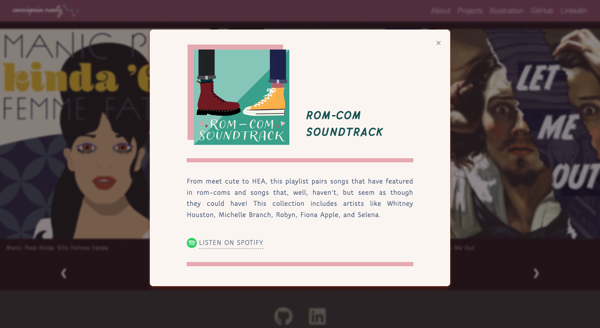

# Portfolio

## Table of Contents

 + [Introduction](#introduction)
 + [Projects](#projects)
     - [Project Images](#project-images)
     - [GitHub Links](#github-links)
     - [Featured Projects](#featured-projects)
 + [Album Art](#album-art)
 + [Favicon](#favicon)
 + [Art Credit](#art-credit)
     - [*Nacht*](#nacht)
     - [*The Bathing Pool*](#the-bathing-pool)
 + [Tech Specs](#tech-specs)

## Introduction

 

 Hello! My name is Cassiopeia Neely, and I am a prospective front-end developer. [My portfolio](https://cassiopeian.github.io/) showcases six web apps I’ve developed, along with some of the art I created to illustrate these projects.

## Projects

 

 ### Project Images

 Use the green arrows on each project card, to scroll through screenshots of notable project features. The three indicators, under the images, can also be used to jump to specific screenshots.

 ### GitHub Links

 To learn more about a project's features, favicon, and more, click the *README* link at the bottom of the card. Click the adjacent project name (or even the project title, at the top of the card), to visit the project.

 ### Featured Projects

 + **[Karteikarten](https://cassiopeian.github.io/Karteikarten)** &mdash; Organized into ten levels of increasing difficulty, Karteikarten features more than 300 German to English flashcards, color-coordinated by category.
 + **[Aisudoku](https://cassiopeian.github.io/aisudoku)** &mdash; Aisudoku is a fun, frozen spin on the number puzzle Sudoku. Players must fill each column, row, and 3&nbsp;×&nbsp;3 grid with one of each of the nine given desserts.
 + **[Case Converter](https://cassiopeian.github.io/case-converter)** &mdash; Do you want to bE a LiTtLe SaRcAsTiC without all the effort? Case Converter can update text to UPPERCASE, lowercase, Title Case, or tOgGlEcAsE, with one click.
 + **[Dog-Age Calculator](https://cassiopeian.github.io/dog-age-calculator)** &mdash; Using super-sophisticated canine math, Dog-Age Calculator converts your human age into dog years.
 + **[Millennial Memory Game](https://cassiopeian.github.io/memory-game)** &mdash; Do you have the recall of an elephant, or are you more of a goldfish? Choose among the three game themes, and test your retention skills with Millennial Memory Game.
 + **[Magic Eight Ball](https://cassiopeian.github.io/magic-eight-ball)**

## Album Art

 

 I loved to create album art for mixtapes, back in high school. So, I jumped at the opportunity to help, when my friend asked me to design something for her 2020 debut EP, *Five Petals of Venus*. I used Microsoft Word! Since then, I’ve regained access to Adobe CC programs, and I’ve been making art for my Spotify playlists.

 Scroll through the carousel with your trackpad or finger, or use the arrows to navigate.

 

 To learn more about a playlist, click the *Info* button, under the album cover. 

## Favicon

 

## Art Credit

 ### *Nacht*

 

 > *Nacht*, Crispijn van de Passe I, 1611&ndash;1637 | [Rijksmuseum &longrightarrow;](https://www.rijksmuseum.nl/nl/collectie/RP-P-2002-698-4 "Nacht")

 ### *The Bathing Pool*

 

 > *The Bathing Pool*, Hubert Robert, 1777&ndash;1780 | [Met Museum &longrightarrow;](https://www.metmuseum.org/art/collection/search/437473 "The Bathing Pool")

## Tech Specs

 This portfolio was built with jQuery version 3.4.1.